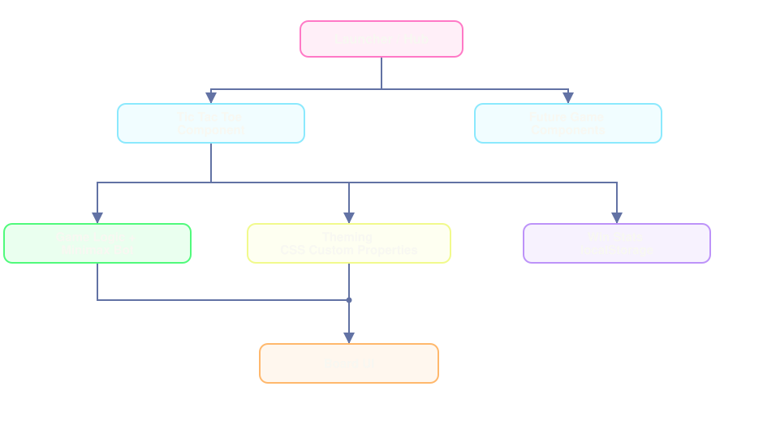

<!--
  EZ-Games — Senior Project presentation slides.
  Written in Marp Markdown. To edit:
    - Install the "Marp for VS Code" extension (marp-team.marp-vscode)
    - Open this file in VS Code and use the built-in preview
    - Slides are separated by a line containing only `---`
-->

# EZ-Games

## A place for quick, fun games — all in one site

**Senior Project 2026–2027**
**Evan Zohrlaut**

---

## Agenda

- What is EZ-Games?
- The problem it solves
- Who it is for
- Main features
- Related work
- Comparison
- Architecture
- The minimax bot
- Why these technologies

---

## What is EZ-Games?

"A place for quick, fun games — all in one site."

A web game center:

- One site, a growing collection of quick games
- One consistent launcher and visual style
- No ads, no accounts, nothing to install

**Single games get boring. Portals are cluttered. EZ-Games is the middle ground.**

---

## The problem it solves

- Any single simple game gets boring after a few rounds
- Big portals are cluttered, ad-supported, and account-gated
- EZ-Games = **variety is the replay value**

---

## Who it is for

- **Casual players / students** — a quick game to fill a few minutes
- **People who like customizing** — a personal look makes it "theirs"
- **Anyone without a second player** — bot opponents make every game playable solo

---

## Main features: The Launcher

- Launcher / Home Page — pick a game in one place
- One consistent look across every game
- Built so more games can plug in later
- First game: **Tic Tac Toe**

---

## Tic Tac Toe — the first game

- Player vs. Bot, or two players on one device
- Three honest difficulty levels: Beginner / Pro / Expert
- Selectable color schemes
- Win streak and total wins saved in the browser

---

## Related work

The market splits into two groups — nobody sits in the middle.

- **Big portals** (Coolmath, Poki, Miniclip): hundreds of games, but ad-supported, account-gated, and every game looks different
- **Single-game options** (Google TTT, Optime TTT): clean and instant, but just one game, no customization, no persistent stats

**The gap:** a clean site that stays simple — no ads, no accounts, stats that just save.

---

## Comparison

|             | Big portals | Single games | **EZ-Games** |
| ----------- | ----------- | ------------ | ------------ |
| Many games  | Yes         | No           | **Yes**      |
| Ads / accounts | Yes      | No           | **No**       |
| Customization | No        | No           | **Yes**      |
| Stats persist | Account    | Rare         | **Local**    |

**EZ-Games** — the variety of a portal, the cleanliness of a single game.

---

## Architecture

- Launcher owns navigation; each game owns its rules and UI
- Minimax is pure logic, reused by all three difficulty tiers
- CSS variables drive theme switching; localStorage persists stats — no server

---

## The minimax bot

- Recursive search over the game tree
- Assumes the opponent plays perfectly — pick the move that bests their best reply
- **Expert**: full minimax — near-perfect, very rarely beatable
- **Pro** / **Beginner**: deliberately weakened versions of the same algorithm
- A 3×3 board keeps the search tiny

---

## Why these technologies

| Choice     | Alternative   | Why it wins                                             |
| ---------- | ------------- | ------------------------------------------------------- |
| JavaScript | TypeScript    | TS adds a second syntax layer; JS is enough for this scope |
| React      | Vue.js        | Same component model, larger ecosystem and docs         |
| Vite       | webpack / CRA | Simpler config, faster development                      |

No third-party libraries beyond React — small state, hand-rolled minimax, native CSS variables.

---

## Summary

- One Center, a growing collection of games
- Honest difficulty, from a real minimax bot
- No ads, no accounts, nothing to install
- Stats saved locally in the browser

---

## Questions?

Thank you