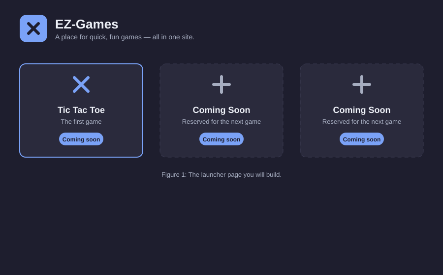

# 1. Introduction

[Home](index.md) · [Next: Scaffolding](02-scaffolding.md)

## What you'll build

You'll build the **main launcher page** of EZ-Games: a screen with a **logo and title at the top** and a grid of **placeholder slots** where future games will live.

{: width="640"}

_Figure 1. The launcher you'll build: a header with logo/title, and a grid of game slots._

## Learning objectives

After finishing this tutorial you'll be able to:

1. **Create and run** a React project with Vite.
2. **Explain** what a React component is and write one in JSX.
3. **Render a list** of items from data using `.map()` and props.
4. **Theme a page** consistently using CSS custom properties.
5. **See how the launcher grows** into a hub that more games plug into.

These are exactly the skills the EZ-Games project needs to add its first game (Tic Tac Toe) later.

## Who this is for

This tutorial is written for a **CS student** who:

- Knows the basics of **HTML and CSS** (tags, classes, colors, simple layout).
- Can write simple **JavaScript** (variables, functions, arrays, objects, `console.log`).
- Has **never used React, JSX, or a build tool** like Vite before.

If that describes you, you're in the right place. If you're comfortable with plain JavaScript but have never touched a component framework, the jump is smaller than it looks — the first section gets you running in about five minutes.

## Prerequisites

### Knowledge

- HTML basics: what `
`, `<h1>`, and `class` attributes are.
- CSS basics: selectors, properties, and why `class` names style elements.
- JavaScript basics: declaring variables, writing functions, and working with arrays and objects.
- Comfort using a **terminal** (command prompt) to run commands and `cd` between folders.

### Installed tools

| Tool | Why you need it | Check it's installed |
| --- | --- | --- |
| [Node.js](https://nodejs.org/) (version 18 or newer) | Runs Vite and npm | Run `node --version` |
| [npm](https://docs.npmjs.com/cli/v10/commands/npm) (comes with Node.js) | Installs and runs project packages | Run `npm --version` |
| A code editor ([VS Code](https://code.visualstudio.com/) is recommended) | Writing and editing the code | — |
| A modern browser (Chrome, Edge, Firefox, Safari) | Viewing the running app | — |

Run both version checks now; if `node --version` prints something like `v22.x.x`, you're ready.

## How the tutorial is organized

| Section | What you'll do |
| --- | --- |
| [1. Introduction](01-introduction.md) | You are here |
| [2. Scaffolding the project](02-scaffolding.md) | Create a Vite + React project and run it |
| [3. Components and JSX](03-components-and-jsx.md) | Learn components; build the header (logo/title) |
| [4. Game slots and lists](04-game-slots.md) | Build placeholder slots from data |
| [5. Styling and theming](05-styling-theming.md) | Give everything one consistent look |
| [6. Summary and next steps](06-summary.md) | Recap, exercises, and where this goes next |

Every section has links to the **next** and **previous** sections, plus a "See also" list of official documentation at the end of the tutorial.

When you're ready, move on to [Section 2: Scaffolding the project](02-scaffolding.md).

---

[Home](index.md) · [Previous: Home](index.md) · [Next: Scaffolding](02-scaffolding.md)