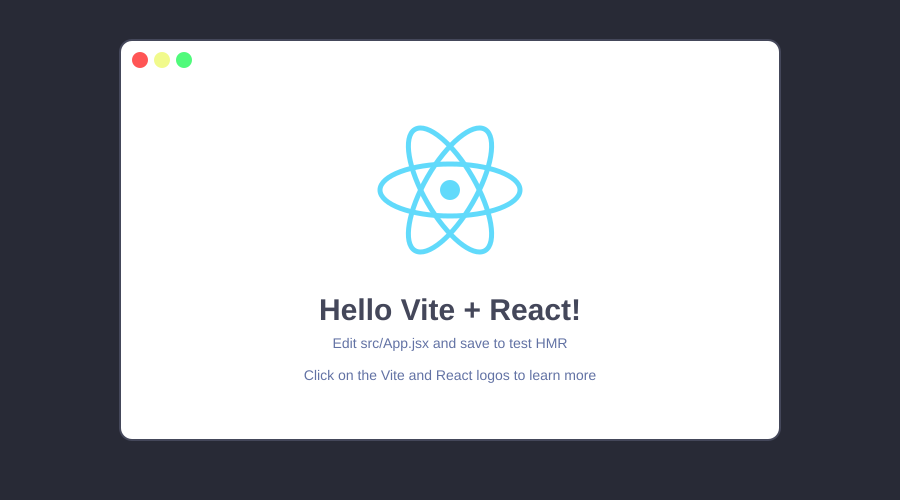

# 2. Scaffolding the project

[Home](index.md) · [Previous: Introduction](01-introduction.md) · [Next: Components and JSX](03-components-and-jsx.md)

In this section you'll create a brand-new React project with **Vite**, install its dependencies, and run it in your browser. This is the tooling step: by the end you'll have a working app skeleton and know what each piece of it does.

## Step 1 — Create the project

Open a terminal in the folder where you want the project to live (for example, your home folder or a `projects` folder), and run:

```bash
npm create vite@latest
```

This command downloads and runs Vite's project generator. It does **not** install anything into your project yet — it just asks you a few questions and then creates a starter project for you.

Vite will ask you a few questions:

1. **Project name** — type the project name you chose in the introduction (the example is `ez-games`) and press Enter.
2. **Select a framework** — use the arrow keys to highlight **React**, press Enter.
3. **Select a variant** — choose **JavaScript** (not TypeScript), press Enter.

> **What just happened:** Vite created a folder named after your project containing the starter project. Inside it you'll find `package.json` (the list of dependencies), `index.html` (the single page), and a `src` folder (where your code will live).

## Step 2 — Install the dependencies

Move into the project folder and install what `package.json` lists:

```bash
cd ez-games        # replace with your project's name
npm install
```

> **What just happened:** `npm install` reads `package.json`, downloads everything the project needs (including React itself), and puts it in a `node_modules` folder. This can take a minute the first time.
>
> **Check:** when the command finishes, the terminal returns to a normal prompt with no errors. You'll also see a `node_modules` folder appear in the project.

## Step 3 — Run the dev server

Now start the development server, which lets you see your page as you build it:

```bash
npm run dev
```

> **What just happened:** `npm run dev` runs the `dev` script from `package.json`. Vite starts a local web server and prints a `Local:` URL, usually `http://localhost:5173`.

Open that address in your browser. You should see the default Vite + React starter page:

{: width="640"}

_Figure 2. The starter page Vite generates for you._

> **Check:** leave the dev server running — every change you make to the code from now on will appear in the browser instantly. This is called **hot module replacement (HMR)**.
>
> **Troubleshooting:** If `npm run dev` fails, the most common cause is an old Node.js version. Run `node --version` and confirm it's v18 or newer ([Node.js downloads](https://nodejs.org/)). You may also need to run `npm install` again.

## Step 4 — Tour the project structure

Open the project in your code editor. Take a look at the structure Vite created:

```
ez-games/
├── public/            # static files copied as-is to the build
├── src/               # your source code
│   ├── assets/        # images and other imported files
│   ├── App.css        # styles for the App component
│   ├── App.jsx        # the top-level component
│   ├── index.css      # global styles
│   └── main.jsx       # the JavaScript entry point
├── index.html         # the single HTML page
├── package.json       # project metadata and dependencies
└── vite.config.js     # Vite configuration
```

Two files matter most right now:

- **`index.html`** — the browser loads this one HTML page. It contains a single `<div id="root">` and a `<script>` tag pointing at `src/main.jsx`.
- **`src/main.jsx`** — the entry point. It finds the `#root` div and tells React to render the `App` component inside it.

## Step 5 — Read the entry point

Open `src/main.jsx` and read it line by line:

```jsx
import { StrictMode } from 'react'
import { createRoot } from 'react-dom/client'
import './index.css'
import App from './App.jsx'

createRoot(document.getElementById('root')).render(
  <StrictMode>
    <App />
  </StrictMode>,
)
```

Three things are happening here, and they're the core pattern of every React app:

1. **`import`** pulls in React, a function called `createRoot`, the global stylesheet, and the `App` component.
2. **`createRoot(document.getElementById('root'))`** finds the empty `<div id="root">` from `index.html` and takes control of it.
3. **`.render(<App />)`** tells React to draw the `App` component into that div.

`App` is your first component — and components are the subject of the next section. For now, open `src/App.jsx` and glance at it: it's a function that returns some markup. That markup is **JSX**.

## Section check

At this point you should have:

- ✅ A project folder created by Vite, named whatever you chose
- ✅ Dependencies installed with `npm install`
- ✅ The dev server running at `http://localhost:5173`
- ✅ An idea of what `main.jsx` and `index.html` do

You now have a running React app. In the next section you'll replace the starter content with your own components.

---

[Home](index.md) · [Previous: Introduction](01-introduction.md) · [Next: Components and JSX](03-components-and-jsx.md)